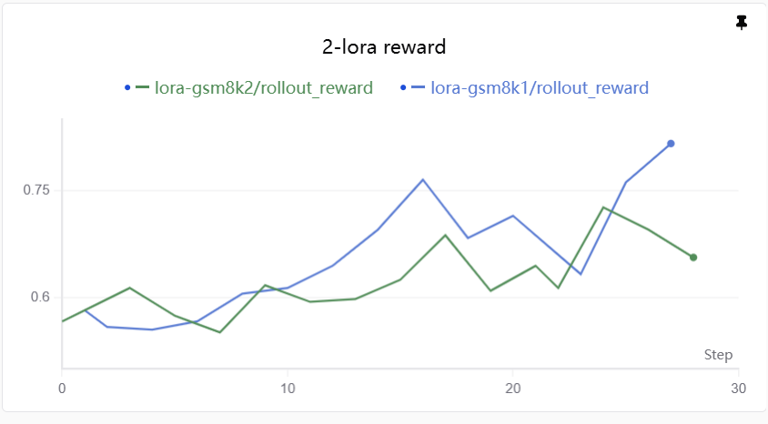

# Setup for Multi-LoRA


## Environmental Settings
`docker pull ghcr.io/hwvanici/areal_npu:v1.0.5-a3`

IMAGE=areal_npu:v1.0.5-a3

```bash
CONTAINER_NAME=my_container
CURRENT_HOSTNAME=$(hostname)
CURRENT_IP=$(hostname -i | awk '{print $1}')

MODEL_PATH=/path/to/model
DATA_PATH=/path/to/data

docker run \
  --privileged \
  --cap-add=SYS_PTRACE \
  --device=/dev/davinci0 \
  --device=/dev/davinci1 \
  --device=/dev/davinci2 \
  --device=/dev/davinci3 \
  --device=/dev/davinci4 \
  --device=/dev/davinci5 \
  --device=/dev/davinci6 \
  --device=/dev/davinci7 \
  --device=/dev/davinci8 \
  --device=/dev/davinci9 \
  --device=/dev/davinci10 \
  --device=/dev/davinci11 \
  --device=/dev/davinci12 \
  --device=/dev/davinci13 \
  --device=/dev/davinci14 \
  --device=/dev/davinci15 \
  --device=/dev/davinci_manager \
  --device=/dev/devmm_svm \
  --device=/dev/hisi_hdc \
  --shm-size=2048g \
  --net=host \
  --name "${CONTAINER_NAME}" \
  --hostname "${CURRENT_HOSTNAME}" \
  --add-host "${CURRENT_HOSTNAME}:${CURRENT_IP}" \
  -v /usr/local/dcmi:/usr/local/dcmi \
  -v /usr/local/Ascend/driver:/usr/local/Ascend/driver \
  -v /etc/ascend_install.info:/etc/ascend_install.info \
  -v /var/log/npu:/usr/slog \
  -v /usr/local/sbin/npu-smi:/usr/local/sbin/npu-smi \
  -v /sys/fs/cgroup:/sys/fs/cgroup:ro \
  -v "${MODEL_PATH}:/models" \
  -v "${DATA_PATH}:/data" \
  -e GIT_SSL_NO_VERIFY=1 \
  -u root \
  -itd "${IMAGE}" /bin/bash
```

Developing off of: `2262610b8c87abe355b98194afcb6d0846c57795`
AReaL Version: `v1.0.5`
vLLM Version: `0.23.0`
vLLM_Ascend Version: `0.23.0rc2.dev107+geaefc536d`

## 2-gsm8k for Qwen3-0.6B
**Async** run (each rollout -> train is asynchronous).

```bash
python examples/multi_lora/multilora_2gsm8k_async.py \
  --config examples/multi_lora/gsm8k_grpo_lora.yaml
```

**Sync** run (all rollouts will continue before they do training sequentially).

```bash
python examples/multi_lora/multilora_2gsm8k_sync.py \
  --config examples/multi_lora/gsm8k_grpo_lora.yaml
```

Below is the reward curve (async training two 0.6B LoRAs on gsm8k):


## 2-gsm8k for Qwen3.8-27B
Please note that 27B does not work with TP. We need to use PP.
```bash
python examples/multi_lora/multilora_2gsm8k_async_27B.py \
  --config examples/multi_lora/gsm8k_grpo_lora.yaml \
  scheduler.type=local \
  gconfig.max_new_tokens=4096 \
  gconfig.max_tokens=8192 \
  cluster.n_nodes=1 \
  cluster.n_gpus_per_node=16 \
  rollout.backend=vllm:d4p2t1 \
  rollout.max_concurrent_rollouts=10000 \
  rollout.max_head_offpolicyness=0 \
  actor.backend=fsdp:d8p1t1 \
  actor.path=/efs_rl/models/Qwen3.8-27B \
  +actor.fsdp.memory_efficient_load=true \
  actor.mb_spec.max_tokens_per_mb=10000 \
  ref.mb_spec.max_tokens_per_mb=10000 \
  actor.optimizer.lr=7e-5 \
  vllm.max_model_len=10000 \
  vllm.gpu_memory_utilization=0.97 \
  vllm.enforce_eager=true \
  train_dataset.batch_size=16 \
  train_dataset.path=/efs_rl/simar/datasets/gsm8k \
  valid_dataset.batch_size=16 \
  valid_dataset.path=/efs_rl/simar/datasets/gsm8k \
  2>&1 | tee out.log
```
